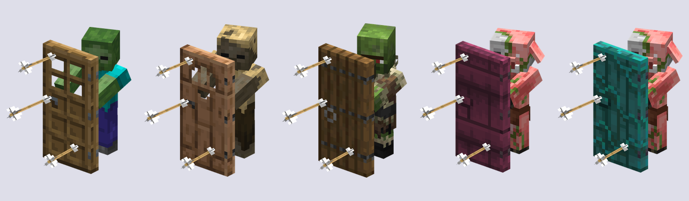
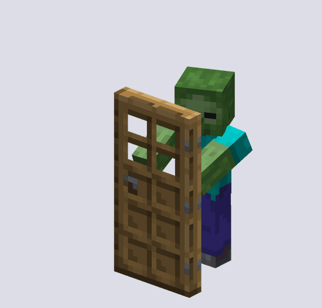
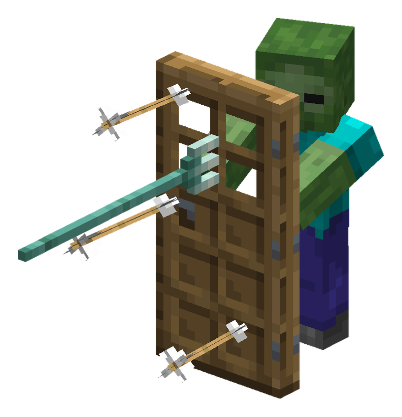
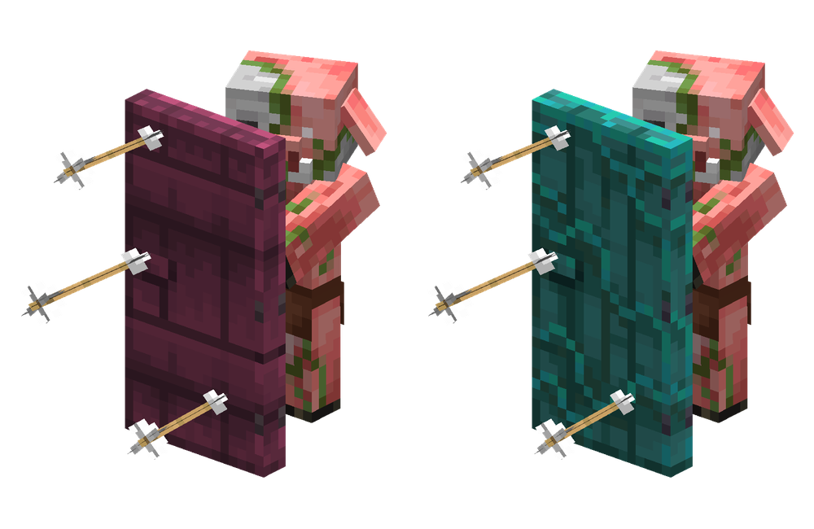
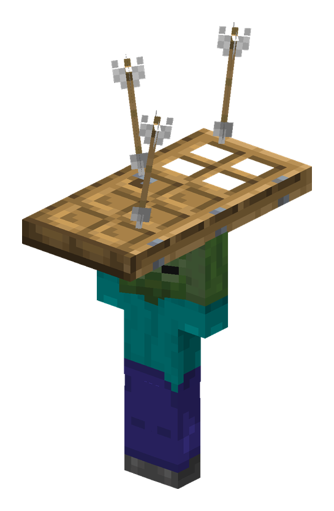

# Zombie Doors


Zombies pick up wooden doors and use them to block attacks, hit players, and
shelter from sunlight. Arrows and tridents stick in the door, blocked hits wear it down, and
axes disable blocking for six seconds.

Adult zombies, husks, and zombie villagers can carry doors. Zombified piglins
carry crimson and warped doors. Babies and drowned cannot carry them.

Carriers can spawn with a door, with the wood type chosen by biome. Door breaking
follows vanilla rules unless you enable the override in the config. Have your
attack blocked to earn **The Zombies Are Coming** advancement.



Doors move with the zombie as it takes cover, swings, and recovers from a hit.





Embedded tridents drop when the door breaks or the carrier loses it. Loyalty
tridents return to their owner.





## Install

[Downloads](https://github.com/CorduroyPhobia/Zombie-Doors/releases) are available
for Minecraft 26.1, 26.1.1, 26.1.2, 26.2, and 26.3. Use the JAR for your version;
the `-sources.jar` is for reading the code.

Requires Fabric Loader, Fabric API, and Java 25. Install the mod and Fabric API
on the server and each client. Mod Menu and Cloth Config are optional, for the
configuration screen.

## Configuration

Edit `config/zombiedoors.json`, or use Mod Menu in singleplayer. On a dedicated
server, run `/reload` after editing the file. See [Configuration](docs/CONFIGURATION.md)
for defaults and biome overrides.

## Build

`main` targets Minecraft 26.1.2. Other versions have a `minecraft/<version>` branch.
Use Java 25 and run:

```powershell
.\gradlew.bat build
```

The JAR is written to `build/libs/`. To launch Minecraft with the mod in development,
run `.\gradlew.bat runClient`.

## License

Created by Corduroy Phobia. All rights reserved; see [LICENSE](LICENSE).
