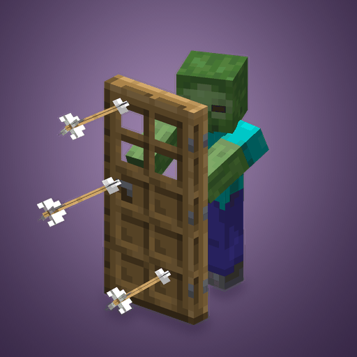

# Zombie Doors

A Fabric mod for Minecraft 26.3, created by **Corduroy Phobia**.



Adult zombies, husks, and zombie villagers can carry wooden doors as shields,
weapons, and cover from sunlight. Babies, drowned, and zombified piglins cannot
carry them.

- Eligible mobs can pick up dropped doors even without normal loot-pickup
  permission. Pickup still respects Mob Griefing and the item's pickup delay.
- Empty-handed mobs have a 5% chance to spawn with a door, or 10% on Hard.
  The wood depends on the biome. Picked-up and broken doors keep their type.
- Doors block frontal melee attacks and projectiles. Blocked hits damage the
  door; axes disable blocking for six seconds. Arrows stay embedded in the wood.
- Carriers can raise the door for shade or swing it in a slower melee attack.
  Attacking, blocking, and axe disabling leave them exposed to sunlight.
- Door breaking follows vanilla rules by default. The config has an override
  for zombies that would not normally break doors.

## Downloads

Each release contains an installable JAR, a sources JAR, and the full source archive.
Choose the release for your exact Minecraft version.

| Minecraft | Release | Branch |
| --- | --- | --- |
| 26.1 | [Download](https://github.com/CorduroyPhobia/Zombie-Doors/releases/tag/v0.1.0-mc26.1) | [Source](https://github.com/CorduroyPhobia/Zombie-Doors/tree/minecraft/26.1) |
| 26.1.1 | [Download](https://github.com/CorduroyPhobia/Zombie-Doors/releases/tag/v0.1.0-mc26.1.1) | [Source](https://github.com/CorduroyPhobia/Zombie-Doors/tree/minecraft/26.1.1) |
| 26.1.2 | [Download](https://github.com/CorduroyPhobia/Zombie-Doors/releases/tag/v0.1.0-mc26.1.2) | [Source](https://github.com/CorduroyPhobia/Zombie-Doors/tree/minecraft/26.1.2) |
| 26.2 | [Download](https://github.com/CorduroyPhobia/Zombie-Doors/releases/tag/v0.1.0-mc26.2) | [Source](https://github.com/CorduroyPhobia/Zombie-Doors/tree/minecraft/26.2) |
| 26.3 | [Download](https://github.com/CorduroyPhobia/Zombie-Doors/releases/tag/v0.1.0-mc26.3) | [Source](https://github.com/CorduroyPhobia/Zombie-Doors/tree/minecraft/26.3) |

## Install

Install the mod and Fabric API on the server and each client. Use Minecraft
26.3, Java 25, and Fabric Loader 0.19.5 or later.

Mod Menu and Cloth Config are optional client mods for the configuration screen.
The mod uses vanilla door and arrow assets, including resource-pack replacements.

26.3 client testing required the JVM argument `-XX:ActiveProcessorCount=4` on
the test PC to avoid a native startup crash that also occurred with Fabric alone.
Both OpenGL and Vulkan passed with the test setup described in the release notes.

## Run from source

Open a terminal in this folder and run:

```powershell
.\gradlew.bat runClient
```

This starts Minecraft with the mod loaded. Restart the client after Java or
mixin changes. In a Creative world with Mob Griefing enabled, drop a wooden door
beside an adult zombie and wait for the pickup delay.

Build the JAR with:

```powershell
.\gradlew.bat build
```

The result is `build/libs/zombie-doors-0.1.0+mc26.3.jar`. Dependency versions are in
`gradle.properties`.

## Configuration

Settings are in `config/zombiedoors.json`, or `run/config/zombiedoors.json` in the
development client. Mod Menu changes take effect immediately in singleplayer.
On a dedicated server, edit the server's file and run `/reload`. The server sends
its settings to clients; their local config files are preserved.

See [Configuration](docs/CONFIGURATION.md) for defaults, combat rules, and biome
door overrides. Older configs keep their saved values; set
`enableReliableZombieDoorBreaking` to `false` to use vanilla breaking rules.

Fabric API contains several registered modules, so Fabric's loaded-mod count is
larger than the number of JARs you installed. The startup log lists them.

## Source and license

[Source code and bug reports](https://github.com/CorduroyPhobia/Zombie-Doors).

All rights reserved. You may download, install, and run unmodified releases for
personal use and on Minecraft servers. The source is available for reference;
modification and redistribution require permission. See [LICENSE](LICENSE).

## Artwork

The GIFs and cover image are in `artwork/`; the cover is also the mod icon.
To recapture the Minecraft models and rebuild the images, run:

```powershell
.\gradlew.bat captureThumbnail
python artwork/build_thumbnail.py
```

The capture uses Fabric's client test runner and stays outside the mod JAR.
The Python script needs Pillow, NumPy, and Windows' Segoe UI font.
